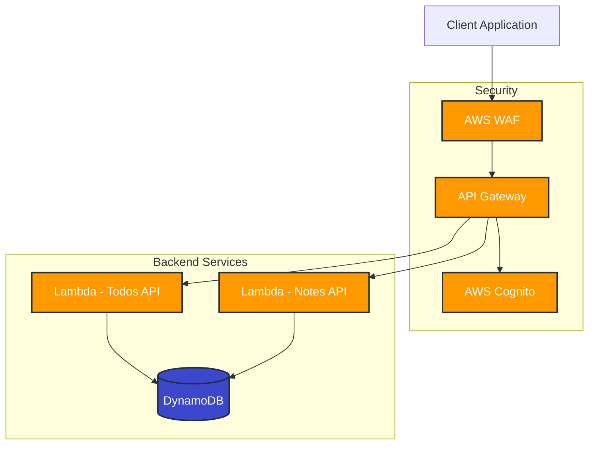

# API Gateway Architecture with WAF Implementation

## Architecture Diagram

## Architecture Components

### 1. Client Layer
- **Client Applications**: Web browsers, mobile apps, or other services that consume the APIs
- **HTTPS**: All communications are encrypted using TLS/SSL
- **Authentication**: JWT token management and refresh logic

### 2. Security Layer
#### AWS WAF (Web Application Firewall)
- **Rate Limiting**: 20 requests per IP address per 60 seconds
- **DDoS Protection**: AWS Shield integration
- **Request Filtering**: 
  - SQL injection prevention
  - Cross-site scripting (XSS) protection
  - IP-based access control
  - Request size limits

#### API Gateway
- **REST API**: RESTful endpoints for Todos and Notes
- **Request Validation**: JSON schema validation
- **Authentication**: JWT token validation via Cognito
- **CORS**: Cross-Origin Resource Sharing configuration
- **Request/Response Transformation**: Data format handling

#### AWS Cognito
- **User Authentication**: JWT-based authentication
- **User Management**: User registration and management
- **Token Management**: 
  - Access Token (1 hour validity)
  - ID Token (1 hour validity)
  - Refresh Token (30 days validity)
- **Security Features**:
  - Password policies
  - MFA support
  - Email verification
  - Token expiration and refresh

### 3. Application Layer
#### Lambda Functions
- **Todos API Lambda**:
  - CRUD operations for todo items
  - Input validation
  - Error handling
  - DynamoDB interactions
  - User context validation
  - Data isolation

- **Notes API Lambda**:
  - CRUD operations for notes
  - Input validation
  - Error handling
  - DynamoDB interactions
  - User context validation
  - Data isolation

### 4. Data Layer
#### Amazon DynamoDB
- **Tables**:
  - Todos table: Stores todo items with user context
  - Notes table: Stores notes with user context
- **Security**:
  - Encryption at rest
  - IAM role-based access
  - VPC endpoint support
- **Indexes**:
  - UserIdIndex for efficient user data queries

## Security Features

### 1. Network Security
- HTTPS encryption for all communications
- VPC endpoints for private access
- Network ACLs and security groups
- WAF protection against common attacks

### 2. Application Security
- JWT-based authentication with Cognito
- Input validation at multiple layers
- Rate limiting with WAF
- DDoS protection
- CORS configuration
- Request/response validation

### 3. Data Security
- Encryption at rest
- Encryption in transit
- IAM role-based access control
- Audit logging
- User data isolation
- Secure token management

## Authentication Flow

1. **User Registration**:
   - Email verification
   - Password policy enforcement
   - Account activation

2. **User Authentication**:
   - JWT token generation
   - Token validation
   - Session management

3. **API Access**:
   - Token validation
   - User context extraction
   - Data isolation enforcement

## Monitoring and Logging

### 1. CloudWatch Integration
- Lambda function logs
- API Gateway access logs
- WAF logs
- DynamoDB metrics
- Authentication attempts
- Token validations

### 2. X-Ray Integration
- Request tracing
- Performance monitoring
- Error tracking
- Authentication flow analysis

## Scalability

### 1. Horizontal Scaling
- Lambda functions auto-scale
- DynamoDB auto-scaling
- API Gateway throttling
- Cognito user pool scaling

### 2. High Availability
- Multi-AZ deployment
- Regional redundancy
- Automatic failover
- Token service redundancy

## Cost Optimization

### 1. Pay-per-use Model
- Lambda execution time
- DynamoDB read/write capacity
- API Gateway requests
- Cognito user operations

### 2. Resource Optimization
- Lambda memory allocation
- DynamoDB capacity planning
- WAF rule optimization
- Token caching strategies 