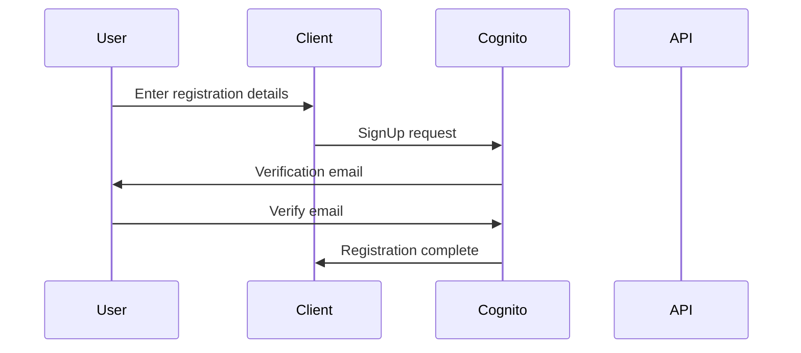
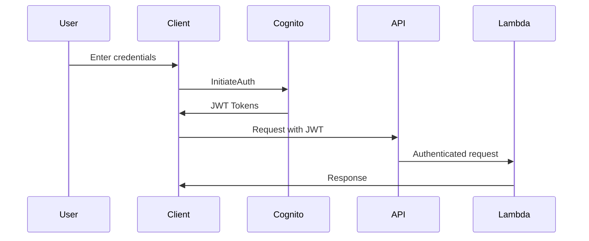
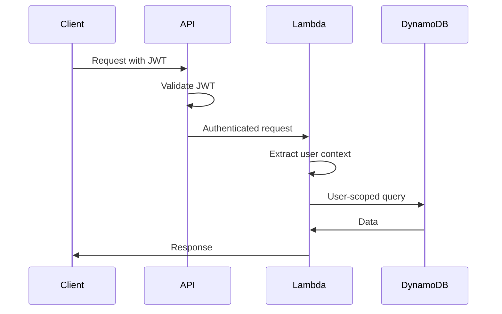

# Authentication Flow Documentation

## Overview

This document describes the authentication flow for the API Gateway implementation, which uses AWS Cognito for user authentication and authorization. The system implements JWT-based authentication with secure token management.

## Architecture Components

1. **AWS Cognito User Pool**
   - Manages user accounts and authentication
   - Handles user registration and verification
   - Issues JWT tokens for API access

2. **API Gateway**
   - Validates JWT tokens
   - Routes authenticated requests to Lambda functions
   - Enforces CORS and security policies

3. **Lambda Functions**
   - Process authenticated requests
   - Validate user context
   - Enforce data isolation

## Authentication Flow

### 1. User Registration



#### Registration Steps:
1. User provides email and password
2. System validates password requirements:
   - Minimum 8 characters
   - Uppercase letters
   - Lowercase letters
   - Numbers
   - Special characters
3. System sends verification email
4. User verifies email address
5. Account is activated

### 2. User Authentication



#### Authentication Steps:
1. User provides credentials
2. System validates credentials
3. System issues three tokens:
   - Access Token (1 hour validity)
   - ID Token (1 hour validity)
   - Refresh Token (30 days validity)
4. Client stores tokens securely
5. Client includes Access Token in API requests

### 3. API Access



#### API Access Steps:
1. Client includes JWT in Authorization header
2. API Gateway validates token
3. Lambda function extracts user context
4. Function enforces data isolation
5. Response is returned to client

## Token Management

### Access Token
- Valid for 1 hour
- Contains user claims and permissions
- Required for API access
- Format: `Bearer <token>`

### ID Token
- Valid for 1 hour
- Contains user identity information
- Used for user session management

### Refresh Token
- Valid for 30 days
- Used to obtain new access tokens
- Should be stored securely

## Security Considerations

### 1. Token Security
- Store tokens securely (HTTP-only cookies or secure storage)
- Never expose refresh tokens in client-side code
- Implement token rotation
- Monitor for token abuse

### 2. API Security
- All endpoints require authentication
- CORS is configured for security
- Rate limiting is enforced
- Input validation is performed

### 3. Data Security
- User data is isolated
- All requests are logged
- Sensitive operations are audited

## Implementation Examples

### 1. User Registration
```bash
# Register a new user
aws cognito-idp sign-up \
  --client-id <your-client-id> \
  --username user@example.com \
  --password YourPassword123! \
  --user-attributes Name=email,Value=user@example.com Name=name,Value=TestUser

# Confirm user registration
aws cognito-idp admin-confirm-sign-up \
  --user-pool-id <your-user-pool-id> \
  --username user@example.com
```

### 2. User Authentication
```bash
# Get authentication tokens
aws cognito-idp admin-initiate-auth \
  --user-pool-id <your-user-pool-id> \
  --client-id <your-client-id> \
  --auth-flow ADMIN_USER_PASSWORD_AUTH \
  --auth-parameters USERNAME=user@example.com,PASSWORD=YourPassword123!
```

### 3. API Access
```bash
# Make authenticated API request
curl -X GET https://<api-id>.execute-api.<region>.amazonaws.com/dev/todos \
  -H "Authorization: Bearer <access-token>" \
  -H "Content-Type: application/json"
```

### 4. Token Refresh
```bash
# Refresh access token
aws cognito-idp admin-initiate-auth \
  --user-pool-id <your-user-pool-id> \
  --client-id <your-client-id> \
  --auth-flow REFRESH_TOKEN_AUTH \
  --auth-parameters REFRESH_TOKEN=<refresh-token>
```

## Error Handling

### Common Error Scenarios

1. **Invalid Token**
   - Status: 401 Unauthorized
   - Response: `{ "message": "Invalid token" }`

2. **Expired Token**
   - Status: 401 Unauthorized
   - Response: `{ "message": "Token expired" }`

3. **Missing Token**
   - Status: 401 Unauthorized
   - Response: `{ "message": "Authorization header is required" }`

4. **Invalid Credentials**
   - Status: 400 Bad Request
   - Response: `{ "message": "Invalid credentials" }`

## Best Practices

1. **Client Implementation**
   - Implement token refresh logic
   - Handle authentication errors gracefully
   - Secure token storage
   - Implement session management

2. **Security Measures**
   - Use HTTPS for all communications
   - Implement proper CORS policies
   - Monitor authentication attempts
   - Regular security audits

3. **User Experience**
   - Clear error messages
   - Smooth authentication flow
   - Proper session handling
   - Automatic token refresh

## Monitoring and Maintenance

1. **CloudWatch Metrics**
   - Authentication attempts
   - Token validations
   - API access patterns
   - Error rates

2. **Regular Maintenance**
   - Review security policies
   - Update password requirements
   - Monitor user activity
   - Audit access patterns 